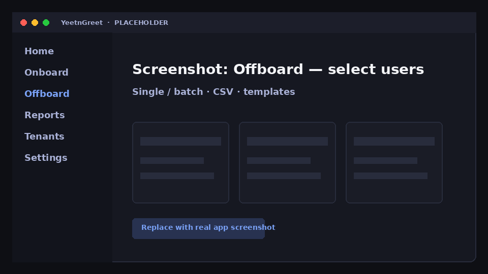
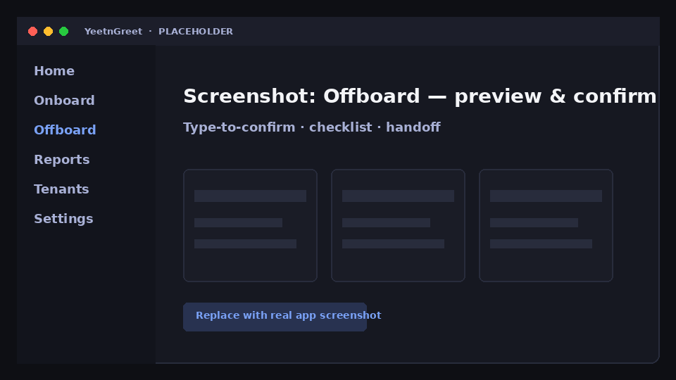

# Offboard

Offboard one person or many. Use templates for handoff, checklist, and shared settings. Preview what will run, confirm deliberately, then go — or [schedule](schedules.md) the job for later on the same PC.

## Before you start

- You are signed into the **correct customer tenant**
- You have the leaver’s identity (UPN / email) or a CSV for batch
- You know where mail / OneDrive / ownership should **hand off**

## Steps

### 1. Open Offboard and select users

Choose a single user, multi-select from a list, or import a **CSV**.

{ width="720" }
*Placeholder — select users for single or batch offboard.*

### 2. Apply template, handoff, and checklist

- **Templates** capture repeatable offboard settings for a customer
- **Handoff** routes mailbox / content ownership as your process requires
- **Checklist** items keep the human steps visible next to the automation

### 3. Preview

Review the planned actions. Fix anything wrong *before* confirm.

{ width="720" }
*Placeholder — preview actions, then type-to-confirm.*

### 4. Type-to-confirm

YeetnGreet asks for a deliberate confirmation (type-to-confirm) so Live offboards are hard to trigger by accident.

### 5. Run now or schedule

- **Run now** — executes on this technician PC
- **Schedule** — queues for a later time on **this same PC** (the machine must be on and signed in as required). See [Schedules](schedules.md).

## Batch tips

| Tip | Why |
| --- | --- |
| Validate CSV columns first | Bad UPNs fail loudly mid-batch |
| Use one template per customer standard | Keeps handoff and checklist consistent |
| Preview a single row before full CSV | Catches tenant / license surprises early |

!!! warning "Live means Live"
    After confirm, Graph changes happen in the customer tenant from this PC. Double-check tenant and users.

## Related

- [Onboard](onboard.md)
- [Schedules](schedules.md)
- [Multi-tenant](../tenants/multi-tenant.md)
