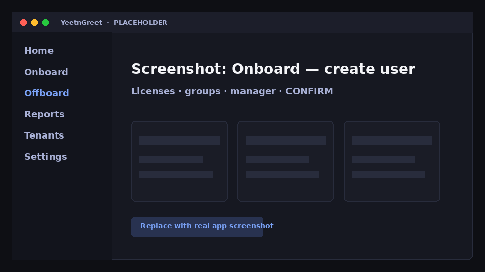

# Onboard

Create or enable Microsoft 365 users, optionally assign licenses, groups, and a manager, then unlock Live work with an explicit **CONFIRM**.

## Before you start

- Correct [tenant](../tenants/multi-tenant.md) selected
- Naming / UPN convention for this customer
- Which SKUs, groups, and manager apply (or a saved template)

## Steps

### 1. Open Onboard

Create a new account or enable an existing one. You can require a **password change** on first sign-in when your process calls for it.

{ width="720" }
*Placeholder — create/enable user with optional licenses, groups, and manager.*

### 2. Optional assignments

| Option | Typical use |
| --- | --- |
| Licenses | Assign the right SKUs up front |
| Groups | Security / M365 groups for access |
| Manager | Org hierarchy and approval routing |

### 3. Templates and CSV

- **Templates** — repeatable onboard defaults per customer
- **CSV** — bulk create/enable with the same confirm path

### 4. CONFIRM

Type **CONFIRM** (or the app’s required confirmation text) to unlock Live onboard. Preview first when the UI offers it.

### 5. Run or schedule

Same model as offboard: run immediately on this PC, or [schedule](schedules.md) for later on this PC.

!!! tip "Test accounts"
    For practice, use a clearly labeled test UPN and remove it when done — especially on production tenants.

## Related

- [Offboard](offboard.md)
- [Schedules](schedules.md)
- [Pricing and licensing](../pricing-and-licensing.md)
