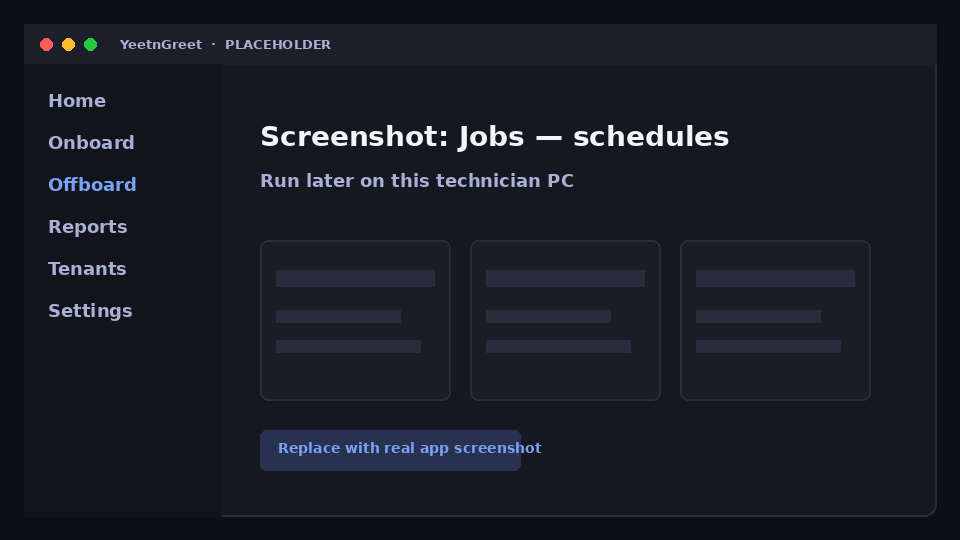

# Schedules

Schedule onboard, offboard, and report jobs to run later on the **same technician PC** where you created them.

## How scheduling works

1. Build the job as usual (users, template, delivery options)
2. Choose a future run time instead of Run now
3. Leave the PC able to run YeetnGreet at that time (powered on, user session / auth as your process requires)

{ width="720" }
*Placeholder — schedule a job for later on this PC.*

!!! important "Schedules are local to the PC"
    A scheduled job does not run in YeetnGreet’s cloud. If the PC is off or YeetnGreet cannot run, the job will not execute until conditions allow — plan cutovers accordingly.

## Good uses

- Friday evening offboards after payroll clears
- Monday morning onboard batches
- Weekly [license](../reports/license-audit.md) or [unused seats](../reports/unused-seats.md) reports with [delivery](../reports/delivery.md)

## Related

- [Offboard](offboard.md)
- [Onboard](onboard.md)
- [Report delivery](../reports/delivery.md)
