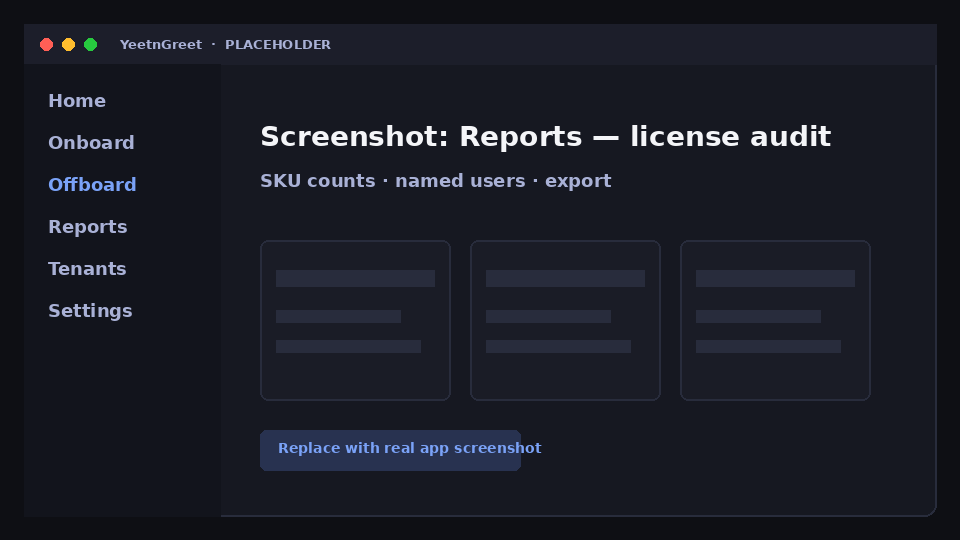

# Reports overview

YeetnGreet reports help you see license waste and plan changes — from the same technician PC model as jobs. Full report detail is available on **Team**, **MSP**, and **Founding** plans; Community includes a limited license-report preview.

## Report types

| Report | Purpose |
| --- | --- |
| [License audit](license-audit.md) | What is assigned, by SKU and user |
| [Unused seats](unused-seats.md) | Licenses that look idle / reclaimable |
| [What-if](what-if.md) | Model license changes before you buy or cut |
| [Samples](samples.md) | Anonymized example output |

## How to run

1. Sign into the customer tenant
2. Open **Reports** and pick a report type
3. Run on demand, or [schedule](../jobs/schedules.md) a recurring run
4. Optionally send results via [Delivery](delivery.md) (email, Teams, Slack, webhooks)

{ width="720" }
*Placeholder — license audit summary in the app.*

!!! note "Data path"
    Report queries use Microsoft Graph from the technician PC. Results you export or send follow the delivery channel you configure — not a YeetnGreet-hosted data lake of customer content.

## Related

- [Pricing and licensing](../pricing-and-licensing.md)
- [Delivery](delivery.md)
