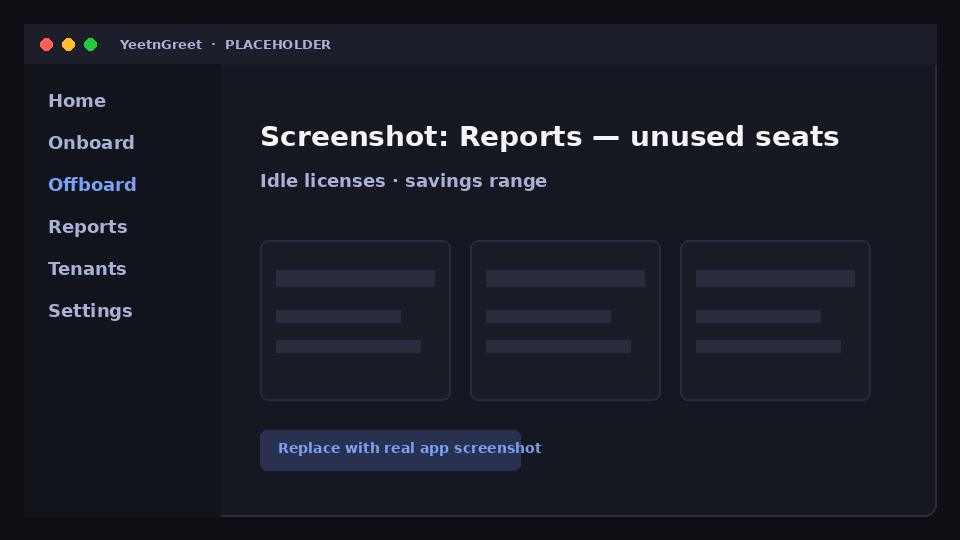

# Unused seats

Find licenses that appear unused so you can reclaim spend — before the renewal meeting.

## When to use it

- Monthly MSP QBR prep
- After offboard waves (catch stragglers)
- When finance asks “where can we cut?”

## Steps

1. Select the customer tenant
2. Open **Reports → Unused seats**
3. Review candidates and validate in the tenant before removing licenses
4. Export or [deliver](delivery.md)

{ width="720" }
*Placeholder — idle licenses and savings range.*

!!! warning "Validate before reclaim"
    “Unused” signals are a starting point. Confirm with the customer’s process (shared mailboxes, break-glass accounts, seasonal staff) before you remove SKUs.

## Related

- [License audit](license-audit.md)
- [What-if](what-if.md)
- [Samples](samples.md)
