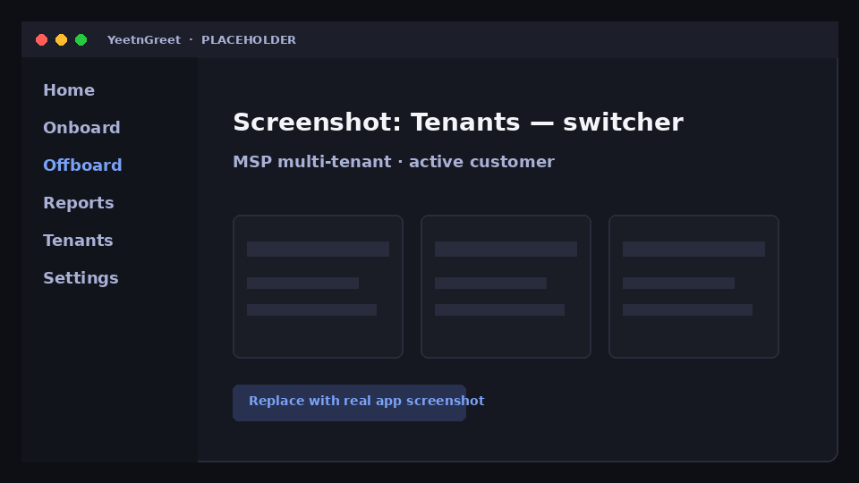

# Multi-tenant

MSP and multi-customer techs switch between the Microsoft 365 tenants they manage without mixing up context — as long as you confirm the active tenant before Live work.

## Switching tenants

1. Open the tenant switcher in YeetnGreet
2. Select the customer you are about to work on
3. Confirm domain / display name matches the ticket
4. Continue with onboard, offboard, or reports

{ width="720" }
*Placeholder — MSP multi-tenant switcher.*

!!! danger "Wrong-tenant rule"
    Preview and type-to-confirm protect actions, but they do not fix picking the wrong customer. Habit: read the tenant name before every confirm.

## Plan limits

| Plan | Managed tenants |
| --- | --- |
| Community | 1 |
| Team | 1 |
| MSP / Founding | 5 included; MSP adds more at **$12 / tenant / mo** |

See [Pricing and licensing](../pricing-and-licensing.md).

## Related

- [Hybrid AD](hybrid-ad.md)
- [First run](../getting-started/first-run.md)
