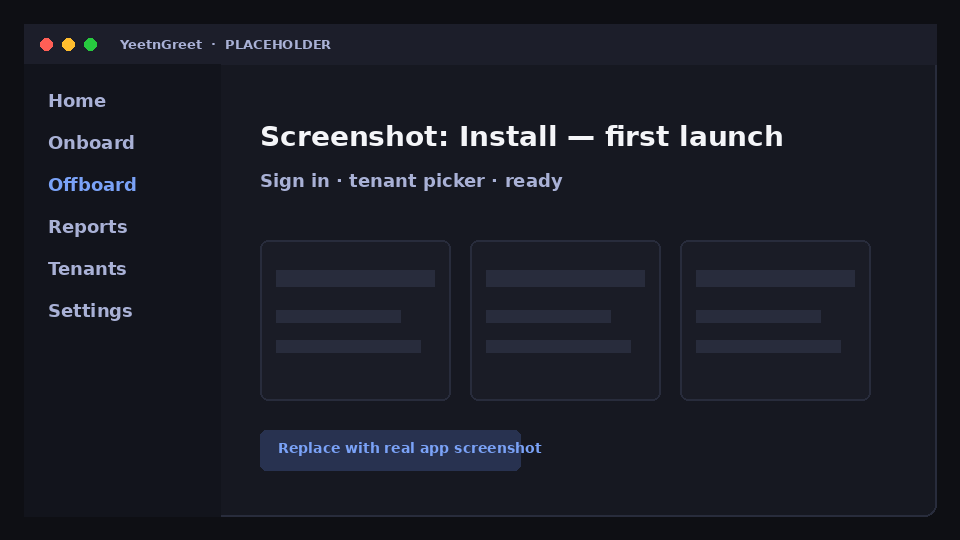
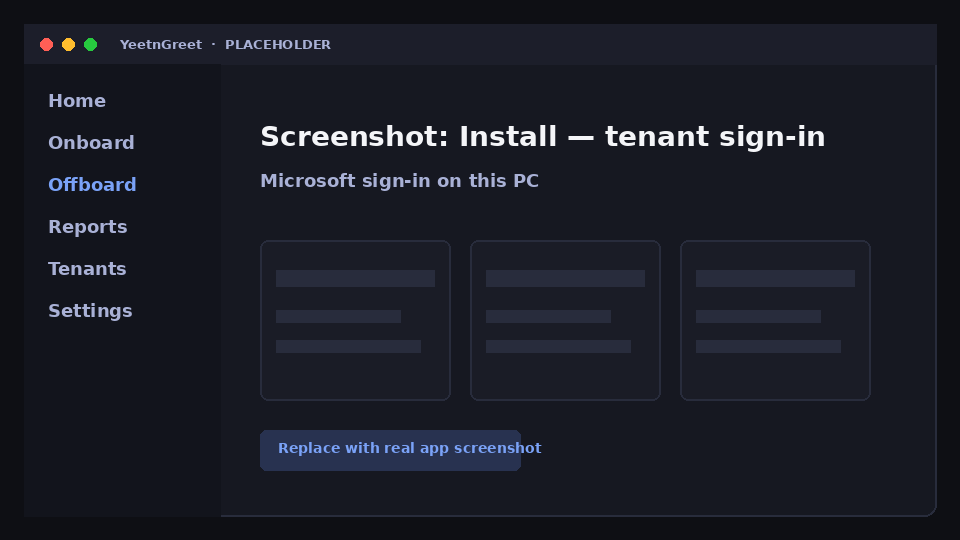

# Install

YeetnGreet is a **Windows single-file** app (`YeetnGreet.exe`) that uses **Microsoft Edge WebView2** for the UI. Install once on each technician PC that will run jobs.

## 1. Get the app

Public Windows downloads are **not available yet**. YeetnGreet ships as a single-file **`YeetnGreet.exe`** with the release. Until then:

1. [Reserve a founding slot](https://yeetngreet.app/#founding) on the homepage (Google Form — $349/yr · 10 slots · 5 tenants)
2. When your build is ready, save **`YeetnGreet.exe`** somewhere durable (for example `C:\Tools\YeetnGreet\` or a shared tech folder)

!!! note "Coming with the release"
    Download links will appear here when the public release ships. Founding members get access through the preregister path first.

## 2. WebView2

Most Windows 10/11 machines already have the **Evergreen WebView2 Runtime**. If the app cannot start the UI:

1. Install (or repair) the [Microsoft Edge WebView2 Runtime](https://developer.microsoft.com/microsoft-edge/webview2/)
2. Run YeetnGreet again

## 3. First launch

1. Double-click `YeetnGreet.exe` (no separate installer required)
2. Allow Windows SmartScreen / firewall prompts if your environment shows them
3. You should see the YeetnGreet shell ready for tenant sign-in

{ width="720" }
*Placeholder UI — replace with a real capture from `%LOCALAPPDATA%\YeetnGreet` or the running app on a technician laptop.*

## 4. Tenant sign-in

Sign in with an account that can administer the **customer Microsoft 365 tenant** you are working in. Graph calls leave from **this PC** to Microsoft — not through YeetnGreet’s vendor cloud.

!!! note "Admin consent first"
    Each customer tenant needs an admin to grant consent for YeetnGreet's Microsoft Graph and Exchange Online permissions before the first job. See [Admin permissions and consent](permissions.md) for the full list.

{ width="720" }
*Placeholder — Microsoft sign-in happens on the technician PC.*

!!! important "What our cloud sees"
    License and billing metadata for your YeetnGreet account only. Not customer mail, files, or directory content used during jobs.

## Next

Continue with [First run](first-run.md) to complete a safe preview job.
